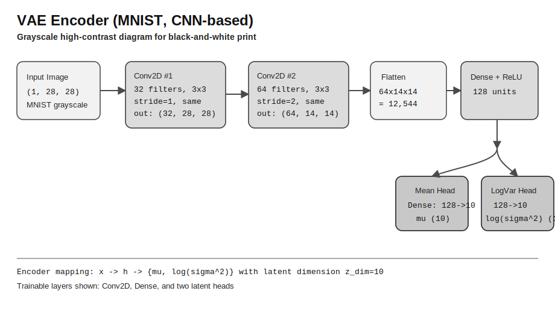
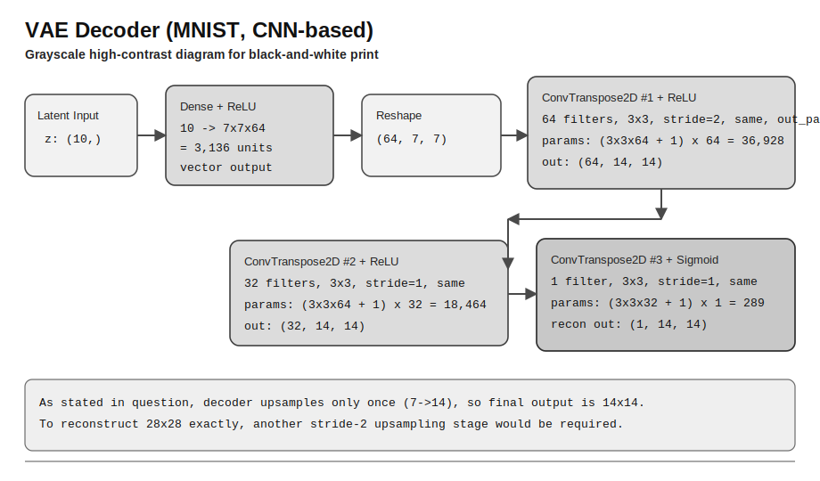

# ADL — Comprehensive February 2026

---

<!-- ═══════════════════════════════════════════════════════ -->
<!-- QUESTION 1 — PAGE 1: QUESTION                          -->
<!-- ═══════════════════════════════════════════════════════ -->

## Q1. CNN-based VAE for MNIST

**Marks:** [4+4+3+1=12] | **Source:** Feb 2026 Comprehensive

**A.** You are implementing a **CNN-based VAE** for the **MNIST dataset** (28×28 grayscale images, 1 channel). The encoder architecture is defined as follows:

**Input shape:** (1, 28, 28)

1. **Conv2D Layer 1:** Filters: 32, Kernel: 3×3, Stride: 1, Padding: same, Activation: ReLU

2. **Conv2D Layer 2:** Filters: 64, Kernel: 3×3, Stride: 2, Padding: same, Activation: ReLU

3. **Flatten Layer**

4. **Dense Layer:** Outputs 128 units, ReLU activation

5. **Latent space:**
   - Mean layer ($\mu$): Dense layer → 10 units
   - Log-variance layer ($\log(\sigma^2)$): Dense layer → 10 units

The decoder architecture is defined as follows:

1. **Dense Layer:** Input = 10 → Output = 7×7×64 units, ReLU activation
2. **Reshape Layer:** Reshape to (64, 7, 7)

3. **ConvTranspose2D Layer 1:** Filters: 64, Kernel: 3×3, Stride: 2, Padding: same, Output padding: 1, Activation: ReLU

4. **ConvTranspose2D Layer 2:** Filters: 32, Kernel: 3×3, Stride: 1, Padding: same, Activation: ReLU

5. **ConvTranspose2D Layer 3 (Output):** Filters: 1, Kernel: 3×3, Stride: 1, Padding: same, Activation: Sigmoid

**(i)** What is the total number of trainable parameters in Encoder? Show all steps. **(4 marks)**

**(ii)** What is the total number of trainable parameters in Decoder? Show all steps. **(4 marks)**

---

**B.** You're working on training a Variational Autoencoder (VAE) that uses a Gaussian latent space with diagonal covariance. During training, for a single input image, the encoder network outputs the following:

Mean vector ($\mu$): $[1.5, -0.5, 0.0, 2.0]$

Log-variance vector ($\log(\sigma^2)$): $[0.0, \log(0.25), \log(1.0), \log(4.0)]$

**(i)** Suppose a random vector $\varepsilon$ is sampled from a standard normal distribution: $\varepsilon = [0.2, -1.0, 0.0, 1.5]$. Use the reparameterization trick to compute the latent vector $z$. **(3 marks)**

**(ii)** Why is the reparameterization trick necessary in VAE? **(1 mark)**

<!-- ═══════════════════════════════════════════════════════ -->
<!-- QUESTION 1 — PAGE 2: TOPICS TO KNOW                    -->
<!-- ═══════════════════════════════════════════════════════ -->

## Q1. Topics to Know

To answer this question, study the following:

- **CNN Architecture & Parameter Counting** — 📖 [3.1 Autoencoder Architecture](../study/03-autoencoders.md#31-autoencoder-architecture) · [3.2 Activation & Loss Functions](../study/03-autoencoders.md#32-activation-and-loss-functions)
  - Conv2D parameters: $(K_h \times K_w \times C_{in} + 1) \times C_{out}$ (weights + biases)
  - Dense layer parameters: $(D_{in} + 1) \times D_{out}$
  - How `padding: same` and `stride` affect spatial dimensions
  - Output size formula: $\lfloor \frac{n + 2p - k}{s} \rfloor + 1$

- **Transposed Convolution (ConvTranspose2D)** — 📖 [3.1 Autoencoder Architecture](../study/03-autoencoders.md#31-autoencoder-architecture)
  - Output size: $(H_{in} - 1) \times s - 2p + k + p_{out}$
  - Parameter count same formula as Conv2D: $(K_h \times K_w \times C_{in} + 1) \times C_{out}$

- **Variational Autoencoder (VAE) Architecture** — 📖 [6.1 Latent Variable Models](../study/06-variational-inferencing.md#61-latent-variable-models) · [6.3 ELBO](../study/06-variational-inferencing.md#63-variational--evidence-lower-bound-elbo)
  - Encoder: maps input → latent distribution parameters ($\mu$, $\log \sigma^2$)
  - Decoder: maps latent vector $z$ → reconstructed output
  - Latent space: defined by mean and log-variance vectors
  - Posterior parameterization: $q_\phi(z\|x)=\mathcal{N}\!\left(\mu_\phi(x), \operatorname{diag}(\sigma_\phi^2(x))\right)$
  - Mean head parameter count (Dense): $(D_{\text{prev}}+1)\times D_z$
  - Log-variance head parameter count (Dense): $(D_{\text{prev}}+1)\times D_z$
  - For this question: $(128+1)\times 10=1{,}290$ for each head

- **Reparameterization Trick** — 📖 [6.4 Optimizing VLB / ELBO](../study/06-variational-inferencing.md#64-optimizing-vlb--elbo)
  - Formula: $z = \mu + \sigma \odot \varepsilon$, where $\varepsilon \sim \mathcal{N}(0, I)$
  - Converting $\log(\sigma^2)$ to $\sigma$: $\sigma = e^{\frac{1}{2}\log(\sigma^2)}$
  - **Why it's needed:** Enables backpropagation through the stochastic sampling step by making the randomness external to the computation graph

- **Flatten Layer**
  - Total units = $C \times H \times W$ after final conv layer

<!-- ═══════════════════════════════════════════════════════ -->
<!-- QUESTION 1 — PAGE 3: SOLUTION                          -->
<!-- ═══════════════════════════════════════════════════════ -->

## Q1. Solution

### Part A(i): Encoder Trainable Parameters (4 marks)

**Input:** (1, 28, 28)

**Layer 1 — Conv2D (32 filters, 3×3, stride 1, same padding):**

- Parameters = $(3 \times 3 \times 1 + 1) \times 32 = 10 \times 32 = \mathbf{320}$
- Output shape: (32, 28, 28) — same padding with stride 1 preserves dimensions

**Layer 2 — Conv2D (64 filters, 3×3, stride 2, same padding):**

- Parameters = $(3 \times 3 \times 32 + 1) \times 64 = 289 \times 64 = \mathbf{18{,}496}$
- Output shape: (64, 14, 14) — stride 2 halves spatial dimensions: $\lfloor 28/2 \rfloor = 14$

**Layer 3 — Flatten:**

- No parameters
- Output: $64 \times 14 \times 14 = 12{,}544$ units

**Layer 4 — Dense (128 units):**

- Parameters = $(12{,}544 + 1) \times 128 = 12{,}545 \times 128 = \mathbf{1{,}605{,}760}$

**Layer 5a — Mean layer (10 units):**

- Parameters = $(128 + 1) \times 10 = 129 \times 10 = \mathbf{1{,}290}$

**Layer 5b — Log-variance layer (10 units):**

- Parameters = $(128 + 1) \times 10 = 129 \times 10 = \mathbf{1{,}290}$

**Total Encoder Parameters:**

$$320 + 18{,}496 + 1{,}605{,}760 + 1{,}290 + 1{,}290 = \boxed{1{,}627{,}156}$$

---

### Part A(ii): Decoder Trainable Parameters (4 marks)

**Input:** latent vector of size 10

**Layer 1 — Dense (7×7×64 = 3,136 units):**

- Parameters = $(10 + 1) \times 3{,}136 = 11 \times 3{,}136 = \mathbf{34{,}496}$
- Output: 3,136 → Reshaped to (64, 7, 7)

**Layer 2 — Reshape:**

- No parameters

**Layer 3 — ConvTranspose2D (64 filters, 3×3, stride 2, same, output padding 1):**

- Parameters = $(3 \times 3 \times 64 + 1) \times 64 = 577 \times 64 = \mathbf{36{,}928}$
- Output shape: (64, 14, 14)

**Layer 4 — ConvTranspose2D (32 filters, 3×3, stride 1, same):**

- Parameters = $(3 \times 3 \times 64 + 1) \times 32 = 577 \times 32 = \mathbf{18{,}464}$
- Output shape: (32, 14, 14)

**Layer 5 — ConvTranspose2D (1 filter, 3×3, stride 1, same):**

- Parameters = $(3 \times 3 \times 32 + 1) \times 1 = 289 \times 1 = \mathbf{289}$
- Output shape: (1, 14, 14)

> **Note:** With stride-1 and same padding in layers 4 and 5, the spatial dimensions remain 14×14, not 28×28. The only upsampling happens in Layer 3 (stride 2: 7→14). The final output would be (1, 14, 14), which doesn't match the original 28×28 input. This suggests the problem may expect ConvTranspose2D Layer 2 to also use stride 2 to achieve 28×28, or there's an implicit upsampling step. Following the question as stated:

**Total Decoder Parameters:**

$$34{,}496 + 36{,}928 + 18{,}464 + 289 = \boxed{90{,}177}$$

---

### Part B(i): Reparameterization Trick — Compute $z$ (3 marks)

Given:
- $\mu = [1.5, -0.5, 0.0, 2.0]$
- $\log(\sigma^2) = [0.0, \log(0.25), \log(1.0), \log(4.0)]$
- $\varepsilon = [0.2, -1.0, 0.0, 1.5]$

**Step 1:** Compute $\sigma$ from $\log(\sigma^2)$:

$$\sigma = e^{\frac{1}{2}\log(\sigma^2)}$$

| Dimension | $\log(\sigma^2)$ | $\frac{1}{2}\log(\sigma^2)$ | $\sigma = e^{(\cdot)}$ |
|-----------|-------------------|------------------------------|-------------------------|
| 1         | $0.0$             | $0.0$                        | $1.0$                   |
| 2         | $\log(0.25)$      | $\frac{1}{2}\log(0.25)$     | $\sqrt{0.25} = 0.5$    |
| 3         | $\log(1.0)$       | $0.0$                        | $1.0$                   |
| 4         | $\log(4.0)$       | $\frac{1}{2}\log(4.0)$      | $\sqrt{4.0} = 2.0$     |

So $\sigma = [1.0, 0.5, 1.0, 2.0]$

**Step 2:** Apply reparameterization trick $z = \mu + \sigma \odot \varepsilon$:

\| Dim \| $\mu_i$ \| $\sigma_i$ \| $\varepsilon_i$ \| $z_i = \mu_i + \sigma_i \cdot \varepsilon_i$ \|
\|-----\|---------\|------------\|------------------\|----------------------------------------------\|
\| 1   \| $1.5$   \| $1.0$      \| $0.2$            \| $1.5 + 1.0 \times 0.2 = \mathbf{1.7}$       \|
\| 2   \| $-0.5$  \| $0.5$      \| $-1.0$           \| $-0.5 + 0.5 \times (-1.0) = \mathbf{-1.0}$  \|
\| 3   \| $0.0$   \| $1.0$      \| $0.0$            \| $0.0 + 1.0 \times 0.0 = \mathbf{0.0}$       \|
\| 4   \| $2.0$   \| $2.0$      \| $1.5$            \| $2.0 + 2.0 \times 1.5 = \mathbf{5.0}$       \|

$$\boxed{z = [1.7, -1.0, 0.0, 5.0]}$$

---

### Part B(ii): Why is the Reparameterization Trick Necessary? (1 mark)

The reparameterization trick is necessary because **direct sampling from a probability distribution is a non-differentiable operation**, which prevents backpropagation through the stochastic latent layer.

By rewriting $z = \mu + \sigma \odot \varepsilon$ (where $\varepsilon \sim \mathcal{N}(0, I)$ is sampled externally), the randomness is moved outside the computational graph. This makes $z$ a **deterministic, differentiable function** of $\mu$ and $\sigma$, allowing gradients to flow from the decoder loss back through $\mu$ and $\sigma$ to the encoder weights.

<!-- ═══════════════════════════════════════════════════════ -->
<!-- QUESTION 2 — PAGE 1: QUESTION                          -->
<!-- ═══════════════════════════════════════════════════════ -->

## Q2. WGAN & Spectral Normalization GAN

**Marks:** [2.5+2.5+1+3+1+1+1=12] | **Source:** Feb 2026 Comprehensive

**A.** You are training a Wasserstein GAN (WGAN) with weight clipping with bounds $[-0.01, 0.01]$.

| Sample Type   | Critic Output |
|---------------|:-------------:|
| Real Sample 1 | 2.3           |
| Real Sample 2 | 1.8           |
| Fake Sample 1 | -0.5          |
| Fake Sample 2 | -1.0          |

**(i)** Compute the Wasserstein critic loss. **(2.5 marks)**

**(ii)** Calculate the Generator Loss. **(2.5 marks)**

**(iii)** Why does WGAN often train the critic more frequently than the generator in each training iteration? **(1 mark)**

---

**B.** You are training a Spectral Normalization GAN (SN-GAN) on CIFAR-10 images. You are working with a fully connected layer in the discriminator with:

- Weight matrix $W \in \mathbb{R}^{3 \times 3}$:

$$W = \begin{bmatrix} 2 & -1 & 0 \\ 1 & 3 & 1 \\ 0 & 1 & -2 \end{bmatrix}$$

**(i)** Compute the spectral norm of $W$ using power method with initial value $[1\ 0\ 0]^\top$ and 2 iterations. **(3 marks)**

**(ii)** Compute the Spectrally Normalized Weight Matrix $W'$. **(1 mark)**

**(iii)** Why is spectral normalization applied in the discriminator but not usually in the generator? **(1 mark)**

**(iv)** Suppose another layer in the discriminator has a weight matrix with spectral norm $\sigma = 12$, and the original weight is 0.6. After spectral normalization, what will be the new weight? **(1 mark)**

<!-- ═══════════════════════════════════════════════════════ -->
<!-- QUESTION 2 — PAGE 2: TOPICS TO KNOW                    -->
<!-- ═══════════════════════════════════════════════════════ -->

## Q2. Topics to Know

To answer this question, study the following:

- **Wasserstein GAN (WGAN)** — 📖 [7.4.1 Wasserstein GAN](../study/07-generative-adversarial-network.md#741-wasserstein-gan-wgan)
  - Critic loss: $L_C = \frac{1}{m}\sum D(x^{(fake)}) - \frac{1}{m}\sum D(x^{(real)})$ (critic minimizes this)
  - Generator loss: $L_G = -\frac{1}{m}\sum D(G(z))$
  - Weight clipping to enforce Lipschitz constraint
  - Why the critic is trained more frequently (better Wasserstein distance estimate)

- **Spectral Normalization** — 📖 [7.4.1 Wasserstein GAN](../study/07-generative-adversarial-network.md#741-wasserstein-gan-wgan)
  - Spectral norm = largest singular value $\sigma_1(W)$
  - Power iteration method: alternate $v \leftarrow \frac{W^\top u}{\|W^\top u\|}$, $u \leftarrow \frac{Wv}{\|Wv\|}$, then $\sigma \approx u^\top W v$
  - Normalized weight: $W' = W / \sigma_1(W)$
  - Applied to discriminator to stabilize training (Lipschitz constraint)
  - Not applied to generator — would limit expressiveness

- **Matrix Operations**
  - Matrix-vector multiplication
  - Vector normalization: $\hat{v} = v / \|v\|$
  - $L_2$ norm: $\|v\| = \sqrt{\sum v_i^2}$

<!-- ═══════════════════════════════════════════════════════ -->
<!-- QUESTION 2 — PAGE 3: SOLUTION                          -->
<!-- ═══════════════════════════════════════════════════════ -->

## Q2. Solution

### Part A(i): Wasserstein Critic Loss (2.5 marks)

The WGAN critic loss is:

$$L_C = \frac{1}{m_{fake}}\sum_{i=1}^{m_{fake}} D(x_i^{(fake)}) - \frac{1}{m_{real}}\sum_{i=1}^{m_{real}} D(x_i^{(real)})$$

**Mean critic output for real samples:**

$$\bar{D}_{real} = \frac{2.3 + 1.8}{2} = 2.05$$

**Mean critic output for fake samples:**

$$\bar{D}_{fake} = \frac{(-0.5) + (-1.0)}{2} = -0.75$$

**Critic loss:**

$$\boxed{L_C = -0.75 - 2.05 = -2.80}$$

The critic **minimizes** this loss (wants to make it more negative → larger gap between real and fake scores).

---

### Part A(ii): Generator Loss (2.5 marks)

The generator loss in WGAN:

$$L_G = -\frac{1}{m_{fake}}\sum_{i=1}^{m_{fake}} D(G(z_i))$$

$$L_G = -\bar{D}_{fake} = -(-0.75)$$

$$\boxed{L_G = 0.75}$$

The generator **minimizes** this loss (wants the critic to assign higher scores to fake samples).

---

### Part A(iii): Why Train Critic More Frequently? (1 mark)

The WGAN critic needs to be a **good approximation of the Wasserstein distance** to provide useful gradients to the generator. With weight clipping, the critic's capacity is limited, so it needs **more update steps** (typically 5 per generator step) to converge to an accurate estimate. A poorly trained critic provides meaningless gradients, causing training instability.

---

### Part B(i): Spectral Norm via Power Method (3 marks)

$$W = \begin{bmatrix} 2 & -1 & 0 \\ 1 & 3 & 1 \\ 0 & 1 & -2 \end{bmatrix}$$

**Initialize:** $u_0 = [1, 0, 0]^\top$

**Iteration 1:**

$v_1' = W^\top u_0 = \begin{bmatrix} 2 \\ -1 \\ 0 \end{bmatrix}$, $\quad \|v_1'\| = \sqrt{4 + 1 + 0} = \sqrt{5}$, $\quad v_1 = \frac{1}{\sqrt{5}}\begin{bmatrix} 2 \\ -1 \\ 0 \end{bmatrix}$

$u_1' = W v_1 = \frac{1}{\sqrt{5}}\begin{bmatrix} 2(2) + (-1)(-1) + 0(0) \\ 1(2) + 3(-1) + 1(0) \\ 0(2) + 1(-1) + (-2)(0) \end{bmatrix} = \frac{1}{\sqrt{5}}\begin{bmatrix} 5 \\ -1 \\ -1 \end{bmatrix}$

$\|u_1'\| = \frac{1}{\sqrt{5}}\sqrt{25 + 1 + 1} = \frac{\sqrt{27}}{\sqrt{5}} = \sqrt{5.4}$, $\quad u_1 = \frac{u_1'}{\|u_1'\|} = \frac{1}{\sqrt{27}}\begin{bmatrix} 5 \\ -1 \\ -1 \end{bmatrix}$

**Iteration 2:**

$v_2' = W^\top u_1 = \frac{1}{\sqrt{27}}\begin{bmatrix} 2(5)+1(-1)+0(-1) \\ -1(5)+3(-1)+1(-1) \\ 0(5)+1(-1)+(-2)(-1) \end{bmatrix} = \frac{1}{\sqrt{27}}\begin{bmatrix} 9 \\ -9 \\ 1 \end{bmatrix}$

$\|v_2'\| = \frac{1}{\sqrt{27}}\sqrt{81 + 81 + 1} = \frac{\sqrt{163}}{\sqrt{27}}$, $\quad v_2 = \frac{v_2'}{\|v_2'\|} = \frac{1}{\sqrt{163}}\begin{bmatrix} 9 \\ -9 \\ 1 \end{bmatrix}$

$u_2' = W v_2 = \frac{1}{\sqrt{163}}\begin{bmatrix} 2(9)+(-1)(-9)+0(1) \\ 1(9)+3(-9)+1(1) \\ 0(9)+1(-9)+(-2)(1) \end{bmatrix} = \frac{1}{\sqrt{163}}\begin{bmatrix} 27 \\ -17 \\ -11 \end{bmatrix}$

$\|u_2'\| = \frac{1}{\sqrt{163}}\sqrt{729 + 289 + 121} = \frac{\sqrt{1139}}{\sqrt{163}}$

**Spectral norm estimate:**

$$\sigma_1 \approx u_2^\top W v_2 = \|u_2'\| = \frac{\sqrt{1139}}{\sqrt{163}} = \sqrt{\frac{1139}{163}} \approx \sqrt{6.988} \approx \boxed{2.644}$$

---

### Part B(ii): Spectrally Normalized Weight Matrix (1 mark)

$$W' = \frac{W}{\sigma_1(W)} = \frac{1}{2.644}\begin{bmatrix} 2 & -1 & 0 \\ 1 & 3 & 1 \\ 0 & 1 & -2 \end{bmatrix} \approx \boxed{\begin{bmatrix} 0.756 & -0.378 & 0 \\ 0.378 & 1.135 & 0.378 \\ 0 & 0.378 & -0.756 \end{bmatrix}}$$

---

### Part B(iii): Why Only in the Discriminator? (1 mark)

Spectral normalization constrains the **Lipschitz constant** of the discriminator to stabilize training and prevent it from producing overly sharp decision boundaries. It is **not applied to the generator** because the generator needs full expressive capacity to learn the complex mapping from latent space to realistic data distributions. Constraining the generator's Lipschitz constant would limit the quality and diversity of generated samples.

---

### Part B(iv): New Weight After Spectral Normalization (1 mark)

$$w' = \frac{w}{\sigma} = \frac{0.6}{12} = \boxed{0.05}$$

<!-- ═══════════════════════════════════════════════════════ -->
<!-- QUESTION 3 — PAGE 1: QUESTION                          -->
<!-- ═══════════════════════════════════════════════════════ -->

## Q3. Energy-Based Models & Diffusion Models

**Marks:** [3+1+2+2=8] | **Source:** Feb 2026 Comprehensive

**A.** You are working with an Energy-Based Model (EBM) for modeling a 1D continuous variable $x \in \mathbb{R}$. The model defines an energy function:

$$\theta(x) = \theta_1 x^2 + \theta_2 x + \theta_3$$

Given, $\theta_1 = 1$, $\theta_2 = -2$, $\theta_3 = 0$,

**(i)** Calculate the partition function $Z(\theta)$. **(3 marks)**

**(ii)** Find the normalized probability density $p_\theta(1)$ at $x = 1$. **(1 mark)**

---

**B.** Consider a simple 1D diffusion model where the forward noising process is defined as:

$$x_t = \sqrt{\alpha_t}\, x_0 + \sqrt{1 - \alpha_t}\, \epsilon$$

where, $x_0$ is the original data sample, $\epsilon \sim \mathcal{N}(0, 1)$ is Gaussian noise, $\alpha_t$ is a scalar noise schedule at timestep $t$. Given, sample $x_0 = 2.0$, noise sample $\epsilon = 0.5$, at $t = 1$, $\alpha_1 = 0.8$, at $t = 2$, $\alpha_2 = 0.5$, calculate the noisy sample $x_2$ at $t = 2$. **(2 marks)**

---

**C.** Consider a 1D DDIM sampling process with known forward noise schedule:

$$\alpha_t, \quad \text{and} \quad \bar{\alpha}_t = \prod_{s=1}^{t} \alpha_s$$

**Given:**

- $t = 2$,
- $\bar{\alpha}_2 = 0.6$,
- $\bar{\alpha}_1 = 0.8$,
- $x_2 = 1.5$,
- Predicted clean sample $\hat{x}_0 = 1.0$,
- Noise scale $\sigma_2 = 0$ (deterministic DDIM),
- $\epsilon_2 = 0.3$ (ignored since $\sigma_2 = 0$).

Compute $x_1$ using the DDIM update formula (with $\sigma_2 = 0$). **(2 marks)**

<!-- ═══════════════════════════════════════════════════════ -->
<!-- QUESTION 3 — PAGE 2: TOPICS TO KNOW                    -->
<!-- ═══════════════════════════════════════════════════════ -->

## Q3. Topics to Know

To answer this question, study the following:

- **Energy-Based Models (EBMs)** — 📖 [9.1 Parametrizing Probability Distributions](../study/09-energy-score-based-models.md#91-parametrizing-probability-distributions) · [9.2 Energy-Based Generative Modeling](../study/09-energy-score-based-models.md#92-energy-based-generative-modeling)
  - Energy function: $E_\theta(x)$
  - Boltzmann distribution: $p_\theta(x) = \frac{e^{-E_\theta(x)}}{Z(\theta)}$
  - Partition function: $Z(\theta) = \int_{-\infty}^{\infty} e^{-E_\theta(x)}\, dx$
  - Gaussian integral: $\int_{-\infty}^{\infty} e^{-ax^2 + bx}\, dx = \sqrt{\frac{\pi}{a}}\, e^{b^2/(4a)}$
  - Completing the square for quadratic energy functions

- **Diffusion Models — Forward Process** — 📖 [8.1 Diffusion Probabilistic Models](../study/08-denoising-diffusion-models.md#81-diffusion-probabilistic-models)
  - Forward noising: $x_t = \sqrt{\bar{\alpha}_t}\, x_0 + \sqrt{1 - \bar{\alpha}_t}\, \epsilon$
  - Noise schedule: $\bar{\alpha}_t = \prod_{s=1}^{t} \alpha_s$
  - Relationship between single-step and cumulative noise schedules

- **DDIM (Denoising Diffusion Implicit Models)** — 📖 [8.3 Denoising Diffusion Implicit Model](../study/08-denoising-diffusion-models.md#83-denoising-diffusion-implicit-model-ddim)
  - Deterministic sampling ($\sigma_t = 0$): $x_{t-1} = \sqrt{\bar{\alpha}_{t-1}}\, \hat{x}_0 + \sqrt{1 - \bar{\alpha}_{t-1}}\, \frac{x_t - \sqrt{\bar{\alpha}_t}\, \hat{x}_0}{\sqrt{1 - \bar{\alpha}_t}}$
  - Stochastic version adds $\sigma_t \epsilon_t$ noise term
  - $\hat{x}_0$ is the predicted clean sample from the denoising network

<!-- ═══════════════════════════════════════════════════════ -->
<!-- QUESTION 3 — PAGE 3: SOLUTION                          -->
<!-- ═══════════════════════════════════════════════════════ -->

## Q3. Solution

### Part A(i): Partition Function $Z(\theta)$ (3 marks)

The energy function: $E(x) = \theta_1 x^2 + \theta_2 x + \theta_3 = x^2 - 2x + 0 = x^2 - 2x$

The partition function:

$$Z(\theta) = \int_{-\infty}^{\infty} e^{-E(x)}\, dx = \int_{-\infty}^{\infty} e^{-(x^2 - 2x)}\, dx = \int_{-\infty}^{\infty} e^{-x^2 + 2x}\, dx$$

**Complete the square:** $-x^2 + 2x = -(x^2 - 2x) = -(x^2 - 2x + 1 - 1) = -(x-1)^2 + 1$

$$Z(\theta) = \int_{-\infty}^{\infty} e^{-(x-1)^2 + 1}\, dx = e^1 \int_{-\infty}^{\infty} e^{-(x-1)^2}\, dx$$

Using the Gaussian integral $\int_{-\infty}^{\infty} e^{-u^2}\, du = \sqrt{\pi}$ (with substitution $u = x - 1$):

$$\boxed{Z(\theta) = e \cdot \sqrt{\pi} \approx 2.718 \times 1.772 \approx 4.817}$$

---

### Part A(ii): Probability Density $p_\theta(1)$ (1 mark)

$$p_\theta(x) = \frac{e^{-E(x)}}{Z(\theta)}$$

At $x = 1$: $E(1) = 1^2 - 2(1) = -1$

$$p_\theta(1) = \frac{e^{-(-1)}}{e\sqrt{\pi}} = \frac{e^1}{e\sqrt{\pi}} = \frac{1}{\sqrt{\pi}}$$

$$\boxed{p_\theta(1) = \frac{1}{\sqrt{\pi}} \approx 0.5642}$$

---

### Part B: Noisy Sample $x_2$ at $t = 2$ (2 marks)

The forward noising uses cumulative noise schedule:

$$x_t = \sqrt{\bar{\alpha}_t}\, x_0 + \sqrt{1 - \bar{\alpha}_t}\, \epsilon$$

**Compute $\bar{\alpha}_2$:**

$$\bar{\alpha}_2 = \alpha_1 \times \alpha_2 = 0.8 \times 0.5 = 0.4$$

**Compute $x_2$:**

$$x_2 = \sqrt{0.4} \times 2.0 + \sqrt{1 - 0.4} \times 0.5$$

$$x_2 = \sqrt{0.4} \times 2.0 + \sqrt{0.6} \times 0.5$$

$$x_2 = 0.6325 \times 2.0 + 0.7746 \times 0.5$$

$$x_2 = 1.2649 + 0.3873$$

$$\boxed{x_2 = 1.6523}$$

---

### Part C: DDIM Update — Compute $x_1$ (2 marks)

The deterministic DDIM update formula ($\sigma_t = 0$):

$$x_{t-1} = \sqrt{\bar{\alpha}_{t-1}}\, \hat{x}_0 + \sqrt{1 - \bar{\alpha}_{t-1}} \cdot \frac{x_t - \sqrt{\bar{\alpha}_t}\, \hat{x}_0}{\sqrt{1 - \bar{\alpha}_t}}$$

**Given:** $t = 2$, $\bar{\alpha}_2 = 0.6$, $\bar{\alpha}_1 = 0.8$, $x_2 = 1.5$, $\hat{x}_0 = 1.0$

**Step 1:** Compute the predicted noise direction:

$$\frac{x_2 - \sqrt{\bar{\alpha}_2}\, \hat{x}_0}{\sqrt{1 - \bar{\alpha}_2}} = \frac{1.5 - \sqrt{0.6} \times 1.0}{\sqrt{0.4}} = \frac{1.5 - 0.7746}{0.6325} = \frac{0.7254}{0.6325} = 1.1469$$

**Step 2:** Compute $x_1$:

$$x_1 = \sqrt{0.8} \times 1.0 + \sqrt{1 - 0.8} \times 1.1469$$

$$x_1 = 0.8944 \times 1.0 + \sqrt{0.2} \times 1.1469$$

$$x_1 = 0.8944 + 0.4472 \times 1.1469$$

$$x_1 = 0.8944 + 0.5129$$

$$\boxed{x_1 = 1.4073}$$

<!-- ═══════════════════════════════════════════════════════ -->
<!-- QUESTION 4 — PAGE 1: QUESTION                          -->
<!-- ═══════════════════════════════════════════════════════ -->

## Q4. Planar Flow & BiLSTM CoVe

**Marks:** [3+2+3=8] | **Source:** Feb 2026 Comprehensive

**A.** In a **planar flow**, a latent variable $\mathbf{z} \in \mathbb{R}^2$ is transformed into $\mathbf{x} \in \mathbb{R}^2$ via:

$$\mathbf{x} = \mathbf{z} + \mathbf{u} \cdot h(\mathbf{w}^\top \mathbf{z} + b)$$

Where:

- $\mathbf{u}, \mathbf{w} \in \mathbb{R}^2$,
- $b \in \mathbb{R}$,
- $h(\cdot)$ is an element-wise activation function (tanh),
- $\mathbf{z} \sim \mathcal{N}(0, I)$ (standard 2D Gaussian).

**Given:**

- $\mathbf{z} = \begin{bmatrix} 1 \\ -1 \end{bmatrix}$, $\quad \mathbf{u} = \begin{bmatrix} 0.5 \\ 0.5 \end{bmatrix}$, $\quad \mathbf{w} = \begin{bmatrix} 1 \\ 2 \end{bmatrix}$, $\quad b = 0$
- Activation: $h(a) = \tanh(a)$

**(i)** Compute the log Jacobian determinant of the transformation: $\log \left\| \det \left( \frac{\partial \mathbf{x}}{\partial \mathbf{z}} \right) \right\|$ **(3 marks)**

**(ii)** Compute $\log p_x(\mathbf{x})$ **(2 marks)**

---

**B.** You are given a single word embedding $\mathbf{x} \in \mathbb{R}^2$ for a token in a sentence:

$$\mathbf{x} = \begin{bmatrix} 1 \\ 2 \end{bmatrix}$$

This word is passed through a **1-layer BiLSTM** (forward and backward pass) with the following simplified configuration:

**LSTM Configuration:** We simplify the LSTM to compute **only the hidden state** using the formula:

$$h = \tanh(Wx + b)$$

This simplification avoids gates and cell states, focusing only on the hidden representation.

**Forward LSTM parameters:**
- $W_f = \begin{bmatrix} 1 & 0 \\ 0 & 1 \end{bmatrix}$, $\quad b_f = \begin{bmatrix} 0.1 \\ -0.1 \end{bmatrix}$

**Backward LSTM parameters:**
- $W_b = \begin{bmatrix} 0 & 1 \\ 1 & 0 \end{bmatrix}$, $\quad b_b = \begin{bmatrix} -0.2 \\ 0.2 \end{bmatrix}$

Compute the CoVe (context vector) using summation. **(3 marks)**

<!-- ═══════════════════════════════════════════════════════ -->
<!-- QUESTION 4 — PAGE 2: TOPICS TO KNOW                    -->
<!-- ═══════════════════════════════════════════════════════ -->

## Q4. Topics to Know

To answer this question, study the following:

- **Normalizing Flows — Planar Flow** — 📖 [5.2 Foundations of 1-D Flow](../study/05-normalizing-flow-models.md#52-foundations-of-1-d-flow) · [5.4 N-Dimensional Flows](../study/05-normalizing-flow-models.md#54-n-dimensional-flows)
  - Transformation: $\mathbf{x} = \mathbf{z} + \mathbf{u} \cdot h(\mathbf{w}^\top \mathbf{z} + b)$
  - Jacobian determinant: $\det\left(\frac{\partial \mathbf{x}}{\partial \mathbf{z}}\right) = 1 + h'(\mathbf{w}^\top \mathbf{z} + b) \cdot \mathbf{u}^\top \mathbf{w}$
  - For tanh: $h'(a) = 1 - \tanh^2(a)$
  - Change of variables: $\log p_x(\mathbf{x}) = \log p_z(\mathbf{z}) - \log \left\| \det \left( \frac{\partial \mathbf{x}}{\partial \mathbf{z}} \right) \right\|$

- **Log probability of standard Gaussian**
  - $\log p_z(\mathbf{z}) = -\frac{d}{2}\log(2\pi) - \frac{1}{2}\|\mathbf{z}\|^2$

- **CoVe (Contextualized Word Vectors)** — 📖 [10.3.2 CoVe](../study/10-language-modeling.md#1032-cove-contextualized-word-vectors)
  - BiLSTM: forward and backward hidden states
  - $h_f = \tanh(W_f \mathbf{x} + b_f)$, $\quad h_b = \tanh(W_b \mathbf{x} + b_b)$
  - CoVe via summation: $\text{CoVe}(\mathbf{x}) = h_f + h_b$

<!-- ═══════════════════════════════════════════════════════ -->
<!-- QUESTION 4 — PAGE 3: SOLUTION                          -->
<!-- ═══════════════════════════════════════════════════════ -->

## Q4. Solution

### Part A(i): Log Jacobian Determinant (3 marks)

For planar flow, the Jacobian determinant has a closed form:

$$\det\left(\frac{\partial \mathbf{x}}{\partial \mathbf{z}}\right) = 1 + h'(\mathbf{w}^\top \mathbf{z} + b) \cdot \mathbf{u}^\top \mathbf{w}$$

**Step 1:** Compute $\mathbf{w}^\top \mathbf{z} + b$:

$$\mathbf{w}^\top \mathbf{z} + b = \begin{bmatrix} 1 & 2 \end{bmatrix} \begin{bmatrix} 1 \\ -1 \end{bmatrix} + 0 = 1(1) + 2(-1) = -1$$

**Step 2:** Compute $h'(-1) = 1 - \tanh^2(-1)$:

$$\tanh(-1) = -0.7616$$

$$h'(-1) = 1 - (-0.7616)^2 = 1 - 0.5800 = 0.4200$$

**Step 3:** Compute $\mathbf{u}^\top \mathbf{w}$:

$$\mathbf{u}^\top \mathbf{w} = 0.5(1) + 0.5(2) = 1.5$$

**Step 4:** Compute the determinant:

$$\det = 1 + 0.4200 \times 1.5 = 1 + 0.63 = 1.63$$

**Log Jacobian determinant:**

$$\boxed{\log \left\| \det \left( \frac{\partial \mathbf{x}}{\partial \mathbf{z}} \right) \right\| = \log(1.63) \approx 0.4886}$$

---

### Part A(ii): Compute $\log p_x(\mathbf{x})$ (2 marks)

Using the change of variables formula:

$$\log p_x(\mathbf{x}) = \log p_z(\mathbf{z}) - \log \left\| \det \left( \frac{\partial \mathbf{x}}{\partial \mathbf{z}} \right) \right\|$$

**Compute $\log p_z(\mathbf{z})$** for $\mathbf{z} = [1, -1]^\top$ under $\mathcal{N}(0, I)$:

$$\log p_z(\mathbf{z}) = -\frac{2}{2}\log(2\pi) - \frac{1}{2}(1^2 + (-1)^2) = -\log(2\pi) - 1$$

$$= -1.8379 - 1 = -2.8379$$

**Final answer:**

$$\log p_x(\mathbf{x}) = -2.8379 - 0.4886$$

$$\boxed{\log p_x(\mathbf{x}) \approx -3.3265}$$

---

### Part B: CoVe via BiLSTM Summation (3 marks)

**Forward hidden state:**

$$h_f = \tanh(W_f \mathbf{x} + b_f) = \tanh\left(\begin{bmatrix} 1 & 0 \\ 0 & 1 \end{bmatrix}\begin{bmatrix} 1 \\ 2 \end{bmatrix} + \begin{bmatrix} 0.1 \\ -0.1 \end{bmatrix}\right) = \tanh\begin{bmatrix} 1.1 \\ 1.9 \end{bmatrix} = \begin{bmatrix} 0.7998 \\ 0.9559 \end{bmatrix}$$

**Backward hidden state:**

$$h_b = \tanh(W_b \mathbf{x} + b_b) = \tanh\left(\begin{bmatrix} 0 & 1 \\ 1 & 0 \end{bmatrix}\begin{bmatrix} 1 \\ 2 \end{bmatrix} + \begin{bmatrix} -0.2 \\ 0.2 \end{bmatrix}\right) = \tanh\begin{bmatrix} 1.8 \\ 1.2 \end{bmatrix} = \begin{bmatrix} 0.9468 \\ 0.8337 \end{bmatrix}$$

**CoVe (summation):**

$$\text{CoVe}(\mathbf{x}) = h_f + h_b = \begin{bmatrix} 0.7998 \\ 0.9559 \end{bmatrix} + \begin{bmatrix} 0.9468 \\ 0.8337 \end{bmatrix} = \boxed{\begin{bmatrix} 1.7466 \\ 1.7896 \end{bmatrix}}$$

---

## Navigation

- [Questions Index](./)
- [Study](../study/)
- [Course Home](../)
- [Back to Homepage](../../)
