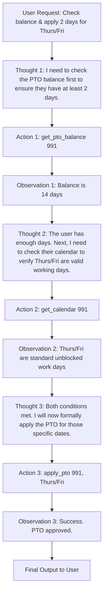

# Conversational AI (AIMLCZG521) - Comprehensive Mock Exam & Answer Key

**Total Marks:** 30
**Format:** 5 Questions × 6 Marks each (4 Scenario-based + 1 Problem)
**Strict Marking Rubric Applied:** 2 distinct points required for every 1 mark. Diagrams adapted strictly to scenarios.

---

## Question 1: Evaluation Metrics & Retrieval Paradigms (Problem) - [6 Marks]

**Problem Statement:**
You are evaluating the retrieval pipeline of an Enterprise RAG system. The vector database returns the top 5 document chunks for a complex user query. Human evaluators have pre-scored the true relevance of these chunks on a scale from 0 to 3 (0 = irrelevant, 3 = perfect).
The system retrieves them in this exact order:
- **Rank 1:** Chunk A (True Relevance = 2)
- **Rank 2:** Chunk B (True Relevance = 0)
- **Rank 3:** Chunk C (True Relevance = 1)
- **Rank 4:** Chunk D (True Relevance = 0)
- **Rank 5:** Chunk E (True Relevance = 3)

**(a) Mathematical Evaluation:** Calculate the Normalized Discounted Cumulative Gain (NDCG) at rank 5. Show the computation for DCG and IDCG. **[3 Marks = 6 Points expected in solution]**

**(b) Retrieval Strategy:** Based on Pre-MidSem concepts, differentiate between Sparse and Dense Retrieval. In the context of the poor ranking above (where the best Chunk E is at Rank 5), clearly explain when to use Sparse vs Dense, and exactly when/why a "Reranker" should be introduced. **[3 Marks = 6 Points expected in solution]**

---

### Solution to Question 1:

**(a) Mathematical Evaluation [3 Marks]** *(Requires 6 distinct steps/points)*
1. **DCG Formula Point:** The formula for Discounted Cumulative Gain is $\sum \frac{rel_i}{\log_2(i+1)}$.
2. **Current DCG Calculation:** calculating the raw DCG for the current ranking: $(2/\log_2(2)) + (0/\log_2(3)) + (1/\log_2(4)) + (0/\log_2(5)) + (3/\log_2(6))$.
3. **Current DCG Summation:** $(2/1) + 0 + (1/2) + 0 + (3/2.58) = 2 + 0 + 0.5 + 0 + 1.16 = \mathbf{3.66}$.
4. **IDCG Logic:** Ideal DCG (IDCG) requires sorting the true relevance scores in perfect descending order: 3, 2, 1, 0, 0.
5. **IDCG Calculation:** $(3/\log_2(2)) + (2/\log_2(3)) + (1/\log_2(4)) + (0) + (0) = 3 + (2/1.58) + 0.5 = 3 + 1.26 + 0.5 = \mathbf{4.76}$.
6. **NDCG Final Calculation:** NDCG = DCG / IDCG = $3.66 / 4.76 = \mathbf{0.768}$ (or 76.8%).

**(b) Retrieval Strategy [3 Marks]** *(Requires 6 distinct points)*
1. **Sparse Retrieval Definition:** Sparse retrieval (like BM25) relies strictly on exact lexical matching (TF-IDF keywords) and maps documents to massive, empty (sparse) vocabulary vectors.
2. **When to use Sparse:** Best used when queries look for exact product IDs, specific acronyms, or proper nouns (e.g., "Error Code 404X").
3. **Dense Retrieval Definition:** Dense retrieval uses Neural Networks to embed text into continuous, dense semantic vectors, calculating contextual similarity via Cosine Distance.
4. **When to use Dense:** Best used for natural language queries involving synonyms, high semantic context, or indirect phrasing (e.g., "How do I fix a broken screen?").
5. **Reranker Definition:** A Reranker (Cross-Encoder) takes the top-K results generated by the initial fast Sparse/Dense retrieval and evaluates the deep attention relationships between the query and each chunk simultaneously.
6. **When to use Reranker:** In this exact scenario, since the best chunk (E) fell to rank 5 because basic Cosine Similarity missed the deep semantic nuance, a Reranker should be used immediately after the initial vector pull to re-sort E up to Rank 1 before passing it to the LLM.

---

## Question 2: RAG Scenarios & LLM Workflows - [6 Marks]

**Scenario:**
A medical research firm is building an AI assistant. The assistant must handle three distinct architectural workflows dynamically based on the user's prompt:
- **Workflow A:** User asks for the boiling point of a well-known chemical.
- **Workflow B:** User asks to summarize a newly uploaded, highly technical 100-page clinical trial PDF. The retrieved chunks often contain conflicting statistics, requiring the LLM to realize it has contradictory data.
- **Workflow C:** User asks for the historical side effects of a drug, but the initial vector search returns outdated papers from 1990. The system must recognize the data is outdated and autonomously rewrite a new query searching specifically for "post-2020 clinical studies".

**(a) RAG Paradigms:** Identify which specific RAG architecture (Self-RAG, Adaptive RAG, or Corrective RAG) perfectly maps to Workflows A, B, and C respectively. Defend your mappings strictly. **[3 Marks = 6 Points expected in solution]**

**(b) LLM Workflows:** Contrast the rigid "Retrieve-then-Generate" monolithic workflow with the dynamic "Agentic LLM Workflow" utilized in Workflow C. **[3 Marks = 6 Points expected in solution]**

---

### Solution to Question 2:

**(a) RAG Paradigms [3 Marks]** *(Requires 6 distinct points)*
1. **Workflow A Mapping:** Maps directly to **Adaptive RAG** (or even zero-shot routing).
2. **Adaptive RAG Justification:** The system uses a classifier at the very beginning to route the query; since predicting a basic chemical boiling point is a factual parametric memory task, Adaptive RAG routes it directly to the LLM without wasting time on vector database retrieval.
3. **Workflow B Mapping:** Maps strictly to **Self-RAG**.
4. **Self-RAG Justification:** Self-RAG utilizes an internal critic LLM to generate reflection tokens (e.g., `[Relevant]`, `[Contradictory]`) continuously during generation. It reflects on its own generated output and rejects it if it notices the retrieved medical chunks contain conflicting stats, preventing hallucination.
5. **Workflow C Mapping:** Maps strictly to **Corrective RAG (CRAG)**.
6. **CRAG Justification:** CRAG features a "Retrieval Evaluator" step immediately after the vector search. Because it fetched 1990s papers, the evaluator scores the retrieval as inadequate, halts generation, and triggers a web-search fallback (or query rewrite) before trying again.

**(b) LLM Workflows [3 Marks]** *(Requires 6 distinct points)*
1. **Monolithic Retrieve-then-Generate:** Operates in a strict, single-pass linear pipe: User Query $\rightarrow$ Embed $\rightarrow$ Search $\rightarrow$ Generate $\rightarrow$ Output.
2. **Monolithic Flaw:** It blindly trusts whatever context is retrieved. If the retrieved documents are outdated, it generates an outdated answer with absolute confidence.
3. **Agentic LLM Workflow Structure:** Discards linear pipelines for cyclical, state-driven graphs (e.g., LangGraph) where the LLM acts as the central router making active decisions over multiple turns.
4. **Agentic Reflection Layer:** Introduces deterministic programmatic checking layers; the LLM output is parsed, graded, and sent back to the LLM if it fails constraints.
5. **Agentic Tool Integration:** Can autonomously construct dynamic API calls mid-thought loop, allowing Workflow C to actively trigger a secondary "Time-filtered" database lookup.
6. **Latency Tradeoff:** While Agentic workflows drastically improve grounding and context accuracy for complex tasks, they massively increase API costs, token overhead, and user latency compared to monolithic workflows.

---

## Question 3: ReAct Framework (Scenario) - [6 Marks]

**Scenario:**
An HR portal uses an Agent strictly constrained to the **ReAct framework**. The employee types: *"How many PTO days do I have left, and can I instantly apply 2 of them for this coming Thursday and Friday?"*
The Agent has the tools: `get_pto_balance(emp_id)`, `get_calendar(emp_id)`, `apply_pto(emp_id, dates)`. Assume the system already knows the user's `emp_id = 991`.

**(a) Execution Loop Diagram:** Draw a customized, scenario-adapted flow diagram specifically tracing the sequence of Thoughts, Actions, and Observations to flawlessly solve this query. **[3 Marks]** *(Diagram = 2 points, plus 4 accompanying written points)*

**(b) ReAct Limitations:** The employee actually asked for dates that the system knows are company-wide blackout days. Explain the inherent architectural flaw in ReAct if the `apply_pto` tool throws an obscure `500 Server Error - Blocked` instead of a natural language explanation. **[3 Marks = 6 Points expected in solution]**

---

### Solution to Question 3:

**(a) Execution Loop Diagram & Trace [3 Marks]** *(Requires Adapted Diagram + 4 points)*

1. **Trace Point 1:** The ReAct loop strictly enforces the serialization of reasoning prior to code execution, preventing the agent from blindly applying PTO before verifying balance.
2. **Trace Point 2:** The Agent must parse the JSON/DB return in `Observation 1` and inject it into its context window to formulate `Thought 2`.
3. **Trace Point 3:** Multi-step tool utilization requires maintaining a cyclical state array (Memory) of all previous actions so the LLM knows it is currently in step 3.
4. **Trace Point 4:** The execution halts and returns to the user only when the `Thought` determines no further actions correlate to the original prompt constraints.

**(b) ReAct Limitations [3 Marks]** *(Requires 6 distinct points)*
1. **Error Handling Blindness:** Foundation LLMs inside basic ReAct loops are trained on natural language, not complex stack traces.
2. **Infinite Looping Vulnerability:** When the tool returns `500 Server Error - Blocked`, the LLM fails to comprehend the specific error, writes the exact same `Thought` ("I must apply the PTO"), and executes the identical `Action` repeatedly.
3. **Token Exhaustion:** This loop will aggressively spin until the context window hits its maximum token limit, ultimately crashing the session and burning immense API costs.
4. **Rigid Formatting Constraints:** ReAct relies on heavily rigid regex parsing (e.g., matching the exact string "Action:"). If the LLM generates "Action taken:", the parser silently drops the execution.
5. **Mitigation via Iteration Limits:** The programmatic orchestrator (e.g., LangChain) must hardcode a strictly enforced `max_iterations=5` cap to forcefully break the infinite loop.
6. **Mitigation via Multi-Agent/Supervisor:** Instead of one struggling ReAct loop, a Supervisor Agent can detect the repetitive failure and physically route the request to a fallback "Error Analysis Agent" or escalate to a direct Human-in-the-Loop approval queue.

---

## Question 4: MCP vs A2A Protocol (Scenario) - [6 Marks]

**Scenario:**
An international shipping port wants to automate logistics. They rely on tightly closed proprietary databases: a Maersk container-tracking SQL setup, a localized Weather API, and a custom Crane Scheduling system. They want an AI assistant to coordinate ships entering the port during heavy storms.
The Chief Architect argues they must use independent **Agents communicating via the A2A Protocol**. The Lead Engineer argues they must use a single centralized Agent connecting via the **Model Context Protocol (MCP)**.

**(a) Protocol Limitations & Selection:** Detail the core architectural limitations of A2A, and definitively justify why the Lead Engineer's MCP architecture is superior for this specific, highly-coupled internal port scenario. **[4 Marks = 8 Points expected in solution]**

**(b) When to use A2A:** Describe a fundamentally different operational scenario where the Chief Architect's A2A Agent architecture would be the mandatory choice over MCP. **[2 Marks = 4 Points expected in solution]**

---

### Solution to Question 4:

**(a) Protocol Limitations & Selection (Why MCP wins here) [4 Marks]** *(Requires 8 distinct points)*
1. **A2A Limitations - Complexity:** A2A requires building separate, fully autonomous LLM decision loops for the Container, Weather, and Crane systems, introducing massive latency as they chat back and forth.
2. **A2A Limitations - Tracing:** Debugging decentralized A2A negotiation graphs (choreography) is notoriously difficult when a crane schedule fails because the weather agent hallucinated.
3. **A2A Limitations - Compute Cost:** Running hundreds of independent worker agents drastically drives up inference costs compared to centralized reasoning.
4. **MCP Definition:** The Model Context Protocol (MCP) is a standard Client-Server architecture allowing a single Agent (Client) to seamlessly connect to entirely disparate local data sources (Servers) securely.
5. **MCP Benefit - Centralized Reasoning:** One massive, highly capable LLM sits in the center. It has total macroscopic awareness of the storm, the ships, and the cranes simultaneously.
6. **MCP Benefit - Integration:** The three proprietary systems simply act as dumb, deterministic "MCP Servers", exposing their raw tools and SQL tables directly to the central agent without needing their own LLM brains.
7. **MCP Benefit - Security Boundaries:** The local MCP servers maintain strict access control; the centralized cloud LLM only receives context when it explicitly calls an MCP tool, keeping proprietary Maersk data safe.
8. **Conclusion for Scenario:** For a tightly coupled, localized logistical problem occurring within a single enterprise boundary, a single orchestrator using MCP servers is significantly faster, cheaper, and vastly easier to constrain than an unwieldy A2A swarm.

**(b) When to use A2A [2 Marks]** *(Requires 4 distinct points)*
1. **Cross-Organizational Boundaries:** A2A is practically mandatory when systems cross rigid trust perimeters (e.g., the Port's Agent needs to negotiate a contract with a completely separate Trucking Company's Agent).
2. **Decentralized Autonomy:** MCP assumes the Client has the right to read/execute tools. In A2A, the Trucking Agent hides its internal tools and database; the Port Agent can only send a natural language *request* via the Protocol.
3. **Dynamic Discovery:** A2A utilizes Agent Cards, allowing agents to dynamically query a registry and find missing capabilities on the fly (e.g., "I need an agent who speaks Mandarin").
4. **Asynchronous Delegation:** Complex workflows requiring days to complete (like hiring personnel or booking international freight) are best delegated totally to highly specialized worker agents, notifying the supervisor upon final resolution.

---

## Question 5: SLM vs LLM, Bias, & Model Compression (Scenario) - [6 Marks]

**Scenario:**
An HR tech company previously used a massive 175B parameter cloud LLM for resume screening. Realizing the LLM was hallucinating "culture fit" metrics and rejecting minority candidates at higher rates (Measurement Bias), they decided to shift to an offline, edge-deployed architecture running natively on localized hardware utilizing a 3B parameter **Small Language Model (SLM)** inside of an Agent workflow.

**(a) Model Compression:** Explain precisely how the engineering team can utilize **Knowledge Distillation** and **Quantization** to shrink the 175B cloud LLM's vast reasoning capabilities effectively into the 3B offline SLM. **[2 Marks = 4 Points expected in solution]**

**(b) SLM vs LLM in Agents:** Beyond just offline capability, strictly justify two operational reasons why using multiple focused SLMs inside an Agent framework is often vastly superior to using a single massive LLM for repetitive enterprise tasks. **[2 Marks = 4 Points expected in solution]**

**(c) Bias Identification & Mitigation:** Identify how the deployment of focused SLMs, combined with targeted mitigation strategies, can specifically eradicate the systemic "culture fit" measurement bias mentioned in the scenario. **[2 Marks = 4 Points expected in solution]**

---

### Solution to Question 5:

**(a) Model Compression [2 Marks]** *(Requires 4 distinct points)*
1. **Knowledge Distillation Definition:** A process where the massive 175B model (Teacher) generates millions of high-quality reasoning traces and outputs based on resumes.
2. **Distillation Transfer:** The 3B model (Student) is explicitly fine-tuned strictly on the Teacher's high-quality outputs, mathematically mimicking its complex statistical distributions without memorizing the internet's raw, bulky parameters.
3. **Quantization Definition:** Slashing the computational footprint of the resulting 3B weights by converting them from 32-bit floating-point numbers (FP32) down to 8-bit or 4-bit integers (INT4).
4. **Quantization Impact:** This mathematically drastically reduces the VRAM requirement exactly, allowing the highly capable distilled weights to run smoothly on edge hardware without memory leakage.

**(b) SLM vs LLM in Agents [2 Marks]** *(Requires 4 distinct points)*
1. **Narrow Task Mastery:** LLMs are generalists (they can write poetry and code). For an HR Agent that *only* parses resumes into JSON arrays, an SLM fine-tuned exclusively on resumes will frequently outperform the LLM on that narrow task.
2. **Latency & UX:** SLMs process tokens astonishingly fast locally, allowing the Agent to cycle through ReAct Thought/Action loops in under a second.
3. **Cost Profiling:** Running continuous loops (like iterating over 5,000 resumes a day) on a cloud LLM API incurs massive cumulative costs; the localized SLM costs zero API fees.
4. **Deterministic Routing:** When orchestrating workflows, a fast SLM can act as the "Router Agent" at the forefront, instantly classifying if an incoming user prompt needs a heavy LLM or a simple SQL lookup, acting as an economic shield.

**(c) Bias Identification & Mitigation [2 Marks]** *(Requires 4 distinct points)*
1. **Measurement Bias Defined:** The system incorrectly used an unquantifiable, historically prejudiced proxy ("culture fit") to mathematically score applicant capability.
2. **Corrupted Training Base:** The foundational 175B LLM was trained on the open internet, inherently absorbing massive amounts of sexism, racism, and toxic historical stereotypes embedded in natural language data.
3. **SLM Mitigation (Clean Slate):** By using an SLM, the HR company can heavily curate its much smaller, highly targeted training dataset, meticulously scrubbing out culturally biased keywords and historical red-lining data before training even begins.
4. **Alignment (DPO/RLHF):** Once the SLM is distilled and localized, the team strictly applies Direct Preference Optimization (DPO)—providing explicit positive rewards only when the SLM scores candidates precisely on technical merit, severely penalizing any weight given to demographics.
