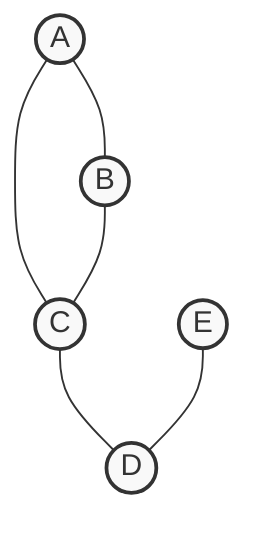
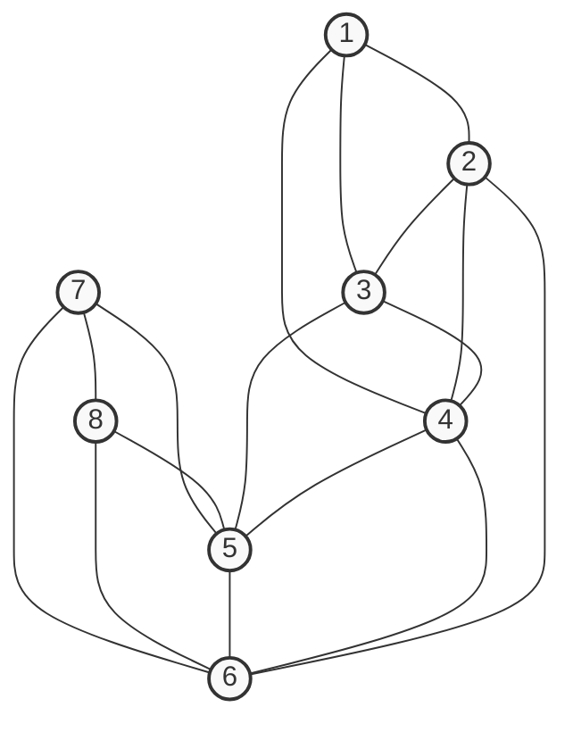

**Course No.:** AIMLCZG522 | **Course Title:** Social Media Analytics | **Date:** 07-Sep-2025 (EN)  

---  
## Q1. Aspect-Based Sentiment Analysis (ABSA)  
**Marks:** 10 | **Source:** Generated  

Write the full question text here. Include any sub-parts as needed:  
**(a)** Define Aspect-Based Sentiment Analysis (ABSA). Restrict your answer to a maximum of 2-3 sentences. **(1 mark)**  
**(b)** Apply the following steps of aspect-based sentiment analysis on the paragraph within quotes below:  
**4 Marks**  
i. Identify at least five nouns and noun phrases. Which NLP technique can be used to automate this step?  
ii. Identify the phrases that express an opinion on the above nouns / noun phrases  
iii. Classify the above phrases into positive, negative, mixed or neutral sentiment. Which machine learning technique can help in automating this step?  
iv. How can Topic Modeling be used to achieve ABSA?  

**“I am so impressed with the new Galaxy S25! The display is so bright and vibrant, making it perfect for watching videos. The battery life is a significant improvement over my last phone; I can easily get through a full day of heavy use. The camera takes stunning photos in daylight, but the low-light performance is a bit grainy. I also love the new fingerprint sensor – it is super fast and accurate. The speakers sound a bit tinny, which is a shame, and the charging port feels a little flimsy. Overall, a great device, but with a few minor flaws.”**  

  

## Q1. Topics to Know  
To answer this question, study the following:  
- **Aspect-Based Sentiment Analysis (ABSA)** — 📖 [ABSA Fundamentals](study/07-sentiment-analysis.md#aspect-based-sentiment-analysis)
  - 📌 Key components: Aspect extraction, opinion detection, sentiment classification  
  - 📌 Applications in social media monitoring  
- **NLP Techniques for Aspect Extraction** — [Named Entity Recognition (NER)](study/06-information-extraction.md#named-entity-recognition)  
  - 📌 POS tagging for noun phrase identification  
  - 📌 Dependency parsing for opinion-target relationships  
- **Sentiment Classification Models** — [ML for Sentiment Analysis](study/07-sentiment-analysis.md#machine-learning-models)  
  - 📌 Naive Bayes, SVM, and deep learning approaches  
  - 📌 Pre-trained models like BERT for context-aware classification  
- **Topic Modeling Applications** — [LDA and Topic Modeling](study/04-autoregressive-models.md#topic-modeling)  
  - 📌 Latent Dirichlet Allocation (LDA) for aspect discovery  
  - 📌 Integrating topics with sentiment analysis pipelines  

  
## Q1. Solution  

### (a) Aspect-Based Sentiment Analysis (ABSA) (1 mark)  
ABSA is a fine-grained sentiment analysis technique that identifies specific aspects (e.g., "display", "battery") in text and determines their associated sentiment (positive/negative/neutral). It goes beyond document-level sentiment to analyze opinions about particular features.  

### (b) Step-by-Step Analysis (4 marks)  
**i. Noun/Noun Phrase Identification (1 mark)**  
Using **Named Entity Recognition (NER)** and **Part-of-Speech (POS) tagging**, we can automate noun phrase extraction. For example:  
- Nouns: Galaxy S25, display, battery life, camera, photos, daylight, low-light performance, fingerprint sensor, speakers, charging port  
- Noun phrases: "low-light performance", "new fingerprint sensor"  

**ii. Opinion Phrase Identification (1 mark)**  
Opinion phrases expressing views on the above nouns:  
- "display is so bright and vibrant" (positive)  
- "battery life is a significant improvement" (positive)  
- "camera takes stunning photos" (positive)  
- "low-light performance is a bit grainy" (negative)  
- "speakers sound a bit tinny" (negative)  
- "charging port feels a little flimsy" (negative)  

**iii. Sentiment Classification (1 mark)**  
Using **BERT-based models** or **SVM with TF-IDF features**, we can classify these phrases:  
- Positive: "bright and vibrant", "significant improvement", "stunning photos"  
- Negative: "grainy", "tinny", "flimsy"  
- Mixed: "great device, but with a few minor flaws"  

**iv. Topic Modeling for ABSA (1 mark)**  
Topic modeling (e.g., LDA) can identify latent aspects like "hardware", "performance", "design" from the text. These topics can then be mapped to sentiment scores to understand overall user satisfaction with specific features.  

  

## Q2. Graph Essentials, Network Measures & Network Models
**Marks:** 5 | **Source:** Past Exam

**a)** Let (V, E) be a directed graph. The adjacency matrix is always symmetric. (True/False) **(0.5 marks)**
**b)** Given a weighted graph, can we find the shortest path between any two vertices using Breadth First Search (BFS)? Justify your answer. **(0.5 marks)**
**c)** Compute the degree centrality, normalized by the degree sum, for each of the nodes in the following graph. Explain the significance of degree centrality in the context of Social Network Analysis. Restrict your answer to a maximum of 2-3 sentences. **(1 mark)**

**d)** Compute the diameter of the network assuming that the distance between any two nodes is 1. What is the significance of network diameter in the context of Social Media Platforms? **(1 mark)**
**e)** Is there an Eulerian path in the above graph? If so, identify the path. What is the practical application of identifying a Euler path? **(1 mark)**
**f)** Is there a Hamiltonian cycle in the above graph? If so, identify the path. What is the practical application of identifying a Hamiltonian cycle? **(1 mark)**

## Q2. Topics to Know
To answer this question, study the following:
- **Graph Essentials** — 📖 [Graph Essentials](study/Module%204%20-%20Machine%20Learning%20%26%20Traditional%20Analytical%20Techniques%20-%20Graph%20Essentials.md)
  - 📌 Directed vs Undirected graphs, Adjacency matrices
  - 📌 Path traversal algorithms like BFS and their suitability
- **Network Measures** — 📖 [Network Measures](study/Module%205%20-%20Machine%20Learning%20%26%20Traditional%20Analytical%20Techniques%20-%20Network%20Measures.md)
  - 📌 Degree Centrality computation and its significance
  - 📌 Network Diameter and eccentricity
- **Network Models** — 📖 [Network Models](study/Module%206%20-%20Machine%20Learning%20%26%20Traditional%20Analytical%20Techniques%20-%20Network%20Models.md)
  - 📌 Eulerian paths and graph traversability
  - 📌 Hamiltonian cycles and their properties

## Q2. Solution

### (a) Adjacency Matrix Symmetry (0.5 marks)
**False**. The adjacency matrix of a directed graph is generally asymmetric because an edge from $u$ to $v$ does not imply an edge from $v$ to $u$.

### (b) BFS on Weighted Graphs (0.5 marks)
**No**. BFS is designed for unweighted graphs as it explores nodes level by level, assuming all edges have a uniform cost of 1. For weighted graphs, algorithms that account for edge weights, such as Dijkstra's algorithm or Bellman-Ford, must be used to find the shortest path.

### (c) Normalized Degree Centrality (1 mark)
The degrees of the nodes are: $deg(A) = 2, deg(B) = 2, deg(C) = 3, deg(D) = 2, deg(E) = 1$.
The sum of all degrees is $2+2+3+2+1 = 10$.
Normalized Degree Centrality ($C_D(v) = \frac{deg(v)}{\sum deg(u)}$):
- $C_D(A) = 2 / 10 = \mathbf{0.2}$
- $C_D(B) = 2 / 10 = \mathbf{0.2}$
- $C_D(C) = 3 / 10 = \mathbf{0.3}$
- $C_D(D) = 2 / 10 = \mathbf{0.2}$
- $C_D(E) = 1 / 10 = \mathbf{0.1}$

**Significance:** Degree centrality indicates the local popularity or immediate influence of a node in a network. In social networks, nodes with high degree centrality represent highly connected users who can act as primary local hubs for rapid information dissemination.

### (d) Network Diameter (1 mark)
The diameter is the longest of all shortest paths between any pair of nodes. The longest shortest path in this graph is between node A (or B) and node E.
Path: A $\rightarrow$ C $\rightarrow$ D $\rightarrow$ E (distance = 3).
Therefore, **Diameter = 3**.
**Significance:** Network diameter represents the maximum distance information must travel to cross the entire network. A smaller diameter indicates a tightly knit social community where information, trends, or rumors can spread very rapidly to all users.

### (e) Eulerian Path (1 mark)
**Yes**, there is an Eulerian path.
An Eulerian path exists in an undirected graph if and only if exactly zero or two vertices have an odd degree. Here, exactly two vertices have odd degrees: node C (degree 3) and node E (degree 1).
**Path:** **E $\rightarrow$ D $\rightarrow$ C $\rightarrow$ A $\rightarrow$ B $\rightarrow$ C** (or its reverse).
**Practical Application:** In social networks, finding an Eulerian path can be used to optimize network crawling patterns to traverse every connection exactly once without redundancy, ensuring efficient data collection or testing of social edges.

### (f) Hamiltonian Cycle (1 mark)
**No**, there is no Hamiltonian cycle.
A Hamiltonian cycle must visit every vertex exactly once and return to the starting vertex. Since node E has a degree of 1, any path entering E cannot leave without retracing the edge (D-E), making it impossible to form a full cycle that visits all nodes.
**Practical Application:** While absent here, finding a Hamiltonian cycle is utilized in solving the Traveling Salesperson Problem, which applies to optimizing delivery logistics, or planning efficient routing networks.

## Q3. Community Analysis
**Marks:** 5 | **Source:** Past Exam

**a)** Assume Cut A splits the above network into two communities: [1,2,3,4] and [5,6,7,8]. Alternately, Cut B splits the above into the communities [1,2,3] and [4,5,6,7,8]. Apply Ratio Cut and Normalized Cut and justify which of these two cuts is preferable? **(2 Marks)**
**b)** Evaluate the total modularity for the given graph by dividing into two 4-clique communities as [1,2,3,4] and [5,6,7,8]. **(3 Marks)**

## Q3. Topics to Know
To answer this question, study the following:
- **Community Detection** — 📖 [Community Detection](study/Module%207%20-%20Community%20and%20Interactions%20-%20Community%20Detection.md)
  - 📌 Graph Cuts, Ratio Cut, and Normalized Cut calculations
  - 📌 Modularity definition and calculation for evaluating community goodness

## Q3. Solution

### (a) Ratio Cut and Normalized Cut (2 Marks)
First, identify the graph's properties:
- Total nodes $|V| = 8$, Total edges $m = 16$.
- $Sum\ of\ all\ degrees = 2 \times 16 = 32$.
- $deg(1)=3, deg(2)=4, deg(3)=4, deg(4)=5, deg(5)=5, deg(6)=5, deg(7)=3, deg(8)=3$.

**Cut A: C1 = [1,2,3,4], C2 = [5,6,7,8]**
- **Cut edges:** (3,5), (4,5), (4,6), (2,6) $\rightarrow cut(C1, C2) = 4$.
- **Sizes:** $|C1| = 4, |C2| = 4$.
- **Volumes:** $Vol(C1) = 3+4+4+5 = 16$, $Vol(C2) = 5+5+3+3 = 16$.
- **Ratio Cut A:** $cut(C1, C2) \times (\frac{1}{|C1|} + \frac{1}{|C2|}) = 4 \times (\frac{1}{4} + \frac{1}{4}) = 4 \times 0.5 = \mathbf{2}$
- **Normalized Cut A:** $cut(C1, C2) \times (\frac{1}{Vol(C1)} + \frac{1}{Vol(C2)}) = 4 \times (\frac{1}{16} + \frac{1}{16}) = 4 \times 0.125 = \mathbf{0.5}$

**Cut B: C1 = [1,2,3], C2 = [4,5,6,7,8]**
- **Cut edges:** (1,4), (2,4), (3,4), (2,6), (3,5) $\rightarrow cut(C1, C2) = 5$.
- **Sizes:** $|C1| = 3, |C2| = 5$.
- **Volumes:** $Vol(C1) = 3+4+4 = 11$, $Vol(C2) = 5+5+5+3+3 = 21$.
- **Ratio Cut B:** $cut(C1, C2) \times (\frac{1}{|C1|} + \frac{1}{|C2|}) = 5 \times (\frac{1}{3} + \frac{1}{5}) = 5 \times \frac{8}{15} \approx \mathbf{2.67}$
- **Normalized Cut B:** $cut(C1, C2) \times (\frac{1}{Vol(C1)} + \frac{1}{Vol(C2)}) = 5 \times (\frac{1}{11} + \frac{1}{21}) = 5 \times \frac{32}{231} \approx \mathbf{0.69}$

**Conclusion:** **Cut A** is preferable because its Ratio Cut (2 < 2.67) and Normalized Cut (0.5 < 0.69) are lower, mathematically minimizing both connections severed and size variance between partitions.

### (b) Total Modularity (3 Marks)
Modularity $Q$ evaluates how well the graph is divided into communities.
$Q = \sum_{c} \left[ \frac{L_c}{m} - \left( \frac{K_c}{2m} \right)^2 \right]$
Where:
- $L_c$ is the number of internal edges in community $c$.
- $K_c$ is the sum of degrees of vertices in community $c$ ($Vol(C)$).
- $m = 16$ (total edges), so $2m = 32$.

**For Community 1 [1,2,3,4]:**
- Internal edges $L_1 = 6$ (a complete 4-clique).
- Volume $K_1 = 16$.
- Modularity term $Q_1 = \frac{6}{16} - \left( \frac{16}{32} \right)^2 = \frac{3}{8} - \left(\frac{1}{2}\right)^2 = 0.375 - 0.25 = 0.125$

**For Community 2 [5,6,7,8]:**
- Internal edges $L_2 = 6$ (a complete 4-clique).
- Volume $K_2 = 16$.
- Modularity term $Q_2 = \frac{6}{16} - \left( \frac{16}{32} \right)^2 = 0.375 - 0.25 = 0.125$

**Total Modularity:**
$Q = Q_1 + Q_2 = 0.125 + 0.125 = \mathbf{0.25}$

## Q4. Analytics and Insights
**Marks:** 5 | **Source:** Past Exam

Consider a brand that is recovering from a recent crisis, such as a product recall. How would you suggest they monitor conversations on social media? The metrics that you can monitor include Sentiment Analysis, Engagement Metrics, Share of Voice, Influence Engagement, Customer Feedback, Trending Topics and Competitor Analysis. For each of these metrics, explain in 1-2 sentences, what you would observe and how it will influence the actions that you take to mitigate the crisis.

## Q4. Topics to Know
To answer this question, study the following:
- **Social Media Monitoring for Crisis Management** — 📖 [Social Media Monitoring](study/13-monitoring-strategy.md#13-1-social-media-monitoring)
  - 📌 Tracking brand health and detecting negative spikes early
  - 📌 Key metrics: Sentiment, volume, and share of voice
- **Key Monitoring Metrics** — [Key Metrics for Monitoring](study/13-monitoring-strategy.md#key-metrics-for-monitoring)
  - 📌 Understanding the impact of different metrics on strategy
- **Competitive Intelligence** — [Social Media Strategy](study/13-monitoring-strategy.md#13-3-social-media-strategy)
  - 📌 Analyzing competitor activity and share of voice

## Q4. Solution

For a brand recovering from a product recall, social media monitoring provides critical real-time feedback. Here is what to observe and the corresponding actions for each metric:

**1. Sentiment Analysis**
- **Observe:** The ratio and trends of positive, negative, and neutral mentions regarding the brand and the recall.
- **Action:** If negative sentiment remains high, issue further apologies or transparent updates. A shift toward neutral or positive sentiment indicates mitigation efforts are working.

**2. Engagement Metrics**
- **Observe:** The volume of likes, shares, replies, and comments on brand announcements versus user-generated complaints.
- **Action:** High engagement on negative posts indicates areas needing immediate clarification. High engagement on apologetic posts shows messages are resonating with the audience.

**3. Share of Voice**
- **Observe:** The volume of your brand's mentions relative to competitors during the crisis period.
- **Action:** If the brand's share of voice is huge but entirely negative, pause promotional campaigns and focus purely on crisis communication to shift the narrative.

**4. Influence Engagement**
- **Observe:** Which key opinion leaders or influencers are discussing the recall and the sentiment of their messaging.
- **Action:** Proactively reach out to critical influencers with facts and solutions to address their concerns, or collaborate with supportive influencers to help rebuild trust.

**5. Customer Feedback**
- **Observe:** Direct complaints, questions, or product issues raised by users on the brand’s social channels.
- **Action:** Route these specific problems to customer support for rapid, personalized resolution, demonstrating accountability and care for affected users.

**6. Trending Topics**
- **Observe:** Common hashtags, keywords, or emerging themes associated with the brand name in real-time.
- **Action:** Identify and address secondary issues (e.g., a rumor about a different product) before they escalate into new crises.

**7. Competitor Analysis**
- **Observe:** How competitors are behaving, whether they are capitalizing on the crisis, or if their customers are expressing similar concerns.
- **Action:** Counter aggressive competitor narratives with strong reassurance of product safety, or adopt successful communication tactics observed in the industry.

---  
## Navigation  
- [Questions Index](index.md)  
- [Study Materials](study/)  
- [Course Home](..)  
- [Back to Homepage](../../)